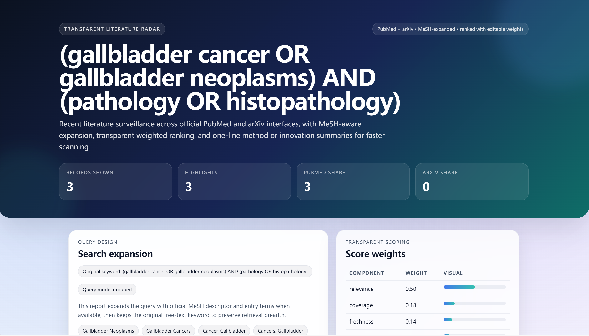
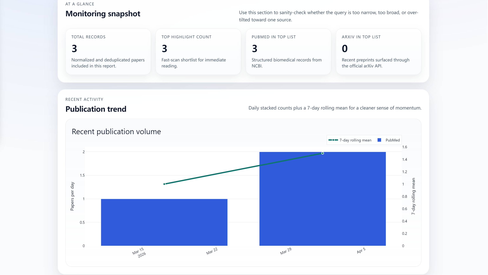
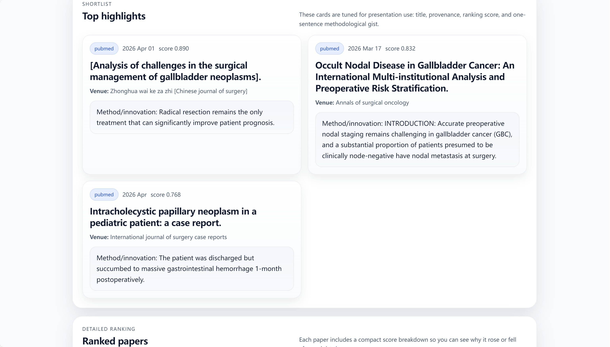

# paper-radar-for-clinicians

<p align="left">
  
  
  
  
  
</p>

**MeSH-aware literature monitoring for PubMed and arXiv, with transparent ranking and polished HTML reports.**

paper-radar is a lightweight monitoring tool for researchers and clinicians who want a cleaner way to track recent papers, review them quickly, and share the results as a presentable report.

<p align="center">
  
  
  
</p>

## What it does

- expands biomedical queries with **MeSH descriptors and entry terms**
- searches **PubMed** and **arXiv** through official interfaces
- supports grouped boolean-style queries such as  
  `("gallbladder cancer" OR "gallbladder neoplasms") AND (multimodal OR "multi-modal") AND (pathology OR histopathology)`
- ranks papers with a **transparent, editable weighted score**
- extracts a **one-line method / innovation summary** from each abstract
- generates a polished **HTML report** with an embedded trend chart
- optionally sends **email digests**
- supports **weekly scheduled updates**

## Why this exists

Most literature monitoring workflows break down in one of three ways: the query logic is too brittle, the ranking logic is opaque, or the output is too ugly to share.

paper-radar is built around a more practical loop:

1. write the query the way people actually search
2. pull recent papers from official sources
3. rank them with editable rules
4. generate a report that is easy to browse and easy to forward

## Core features

### MeSH-aware expansion

For biomedical topics, paper-radar can expand terms using official MeSH descriptors and entry terms instead of relying only on raw keyword matching.

### Familiar grouped query syntax

The query string supports a search style that feels close to real literature searching:

- **OR inside each group**
- **AND between groups**
- **parentheses**
- **quoted phrases**

Example:

```text
("gallbladder cancer" OR "gallbladder neoplasms") AND (multimodal OR "multi-modal") AND (pathology OR histopathology)
```

This keeps the CLI simple while still letting users express multi-concept searches without learning a custom syntax.

### Transparent ranking

Each paper is scored using configurable components such as:

- relevance
- coverage
- freshness
- evidence
- source prior
- completeness

Weights live in YAML, so the ranking logic is visible and easy to tune.

### Shareable output

The main output is a polished `report.html` page with:

- topic overview
- parsed query groups
- highlighted papers
- detailed ranking breakdown
- embedded publication trend chart

### Automation-ready

paper-radar can be run:

- manually from the command line
- on a local scheduler
- through GitHub Actions on a weekly schedule

## Installation

Python 3.10+ is recommended.

```bash
python -m pip install -e .
```

If your machine has multiple Python installations, using `python -m pip` is safer than calling `pip` directly.

## Quick start

### Example 1: simple topic

```bash
python -m paper_radar.cli report "multimodal imaging" \
  --days 30 \
  --weights configs/default_weights.yml \
  --outdir outputs \
  --max-results-pubmed 60 \
  --max-results-arxiv 20 \
  --ncbi-email "your_email@example.com"
```

### Example 2: grouped boolean query

```bash
python -m paper_radar.cli report '("gallbladder cancer" OR "gallbladder neoplasms") AND (multimodal OR "multi-modal") AND (pathology OR histopathology)' \
  --days 30 \
  --weights configs/default_weights.yml \
  --outdir outputs \
  --max-results-pubmed 60 \
  --max-results-arxiv 20 \
  --ncbi-email "your_email@example.com"
```

## Output structure

A typical run produces:

```text
outputs/<topic>/
├─ report.html
├─ report.md
├─ papers.csv
└─ run_metadata.json
```

### Output files

- `report.html` — main visual report
- `report.md` — compact text summary
- `papers.csv` — ranked table for downstream review
- `run_metadata.json` — query mode, parsed groups, and run metadata

## Weekly updates

To run multiple topics from a config file:

```bash
python -m paper_radar.cli update \
  --topics configs/topics.example.yml \
  --weights configs/default_weights.yml \
  --outdir weekly_reports \
  --ncbi-email "your_email@example.com"
```

This can be scheduled locally or through GitHub Actions.

## Optional email delivery

Email delivery is optional and requires SMTP environment variables.

```bash
python -m paper_radar.cli report "multimodal imaging" \
  --days 30 \
  --weights configs/default_weights.yml \
  --outdir outputs \
  --ncbi-email "your_email@example.com" \
  --email-to "recipient@example.com"
```

For a Chinese clinician-facing setup guide, including a QQ Mail SMTP example, see:

- [docs/quickstart_zh.md](./docs/quickstart_zh.md)

## Configuration

### Ranking weights

Edit:

```text
configs/default_weights.yml
```

### Topic list for recurring runs

Edit:

```text
configs/topics.example.yml
```

## Notes

- PubMed querying uses official NCBI E-utilities.
- arXiv querying uses the official arXiv API.
- MeSH expansion uses official MeSH data / endpoints.
- This project is intended for monitoring and triage, not as a replacement for formal systematic review methodology.

## For clinicians / 中文快速说明

A clinician-friendly Chinese quickstart is available here:

- [docs/quickstart_zh.md](./docs/quickstart_zh.md)
